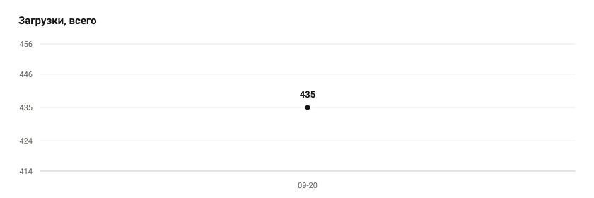

# umbrella-work

Lua-скрипты для Umbrella и приложение MusicUI.

<!-- scripts:ru:start -->
- [Lane Pull](scripts/lane_pull) — выпул вражеской волны крипом с Доминатора
- [DS Spot Block](scripts/ds_spot_block) — блок спота Вакуумом за Dark Seer
- [Custom Background](scripts/custom_background) — свои картинки на фоне меню
- [MusicUI](scripts/musicui) — оверлей плеера: трек, обложка, эквалайзер, текст
<!-- scripts:ru:end -->

Открой скрипт: там описание, установка и все версии со ссылками на файлы.

## Установка

Скачай `.lua` из релиза и положи в папку `scripts` рядом с читом, включи в меню `Scripts`.
MusicUI: распакуй архив, `MusicUI.lua` в `scripts`, запусти `MusicUI.exe`.

Язык меню берется из языка чита, скрипты понимают русский и английский.

## Спасибо

`lib/qlocalizer.lua` — библиотека qLocalization, автор qfun (qfun_g9s).

---

# English

Lua scripts for Umbrella and the MusicUI app.

<!-- scripts:en:start -->
- [Lane Pull](scripts/lane_pull) — pull the enemy wave with your Dominator creep
- [DS Spot Block](scripts/ds_spot_block) — Vacuum spot block for Dark Seer
- [Custom Background](scripts/custom_background) — your own pictures behind the menu
- [MusicUI](scripts/musicui) — player overlay: track, cover, equalizer, lyrics
<!-- scripts:en:end -->

Open a script: its page has the description, install steps and every version with direct links.

## Install

Download the `.lua` from a release, drop it into the `scripts` folder next to your cheat and turn
it on under `Scripts`.
MusicUI: unzip the archive, put `MusicUI.lua` into `scripts`, run `MusicUI.exe`.

The menu follows your cheat language; the scripts speak Russian and English.

## Credits

`lib/qlocalizer.lua` is the qLocalization library by qfun (qfun_g9s).

## Downloads

<!-- stats:start -->
| script | downloads | latest |
| --- | --- | --- |
| [Lane Pull](scripts/lane_pull) | 202 | `lane-pull-v1.0.4` |
| [DS Spot Block](scripts/ds_spot_block) | 36 | `ds-spot-block-v1.0.1` |
| [Custom Background](scripts/custom_background) | 8 | `custom-background-v1.0.0` |
| [MusicUI](scripts/musicui) | 513 | `musicui-v1.0.8` |

<picture>
  <source media="(prefers-color-scheme: dark)" srcset=".github/stats/stats-dark.svg">
  
</picture>

2026-09-23
<!-- stats:end -->
